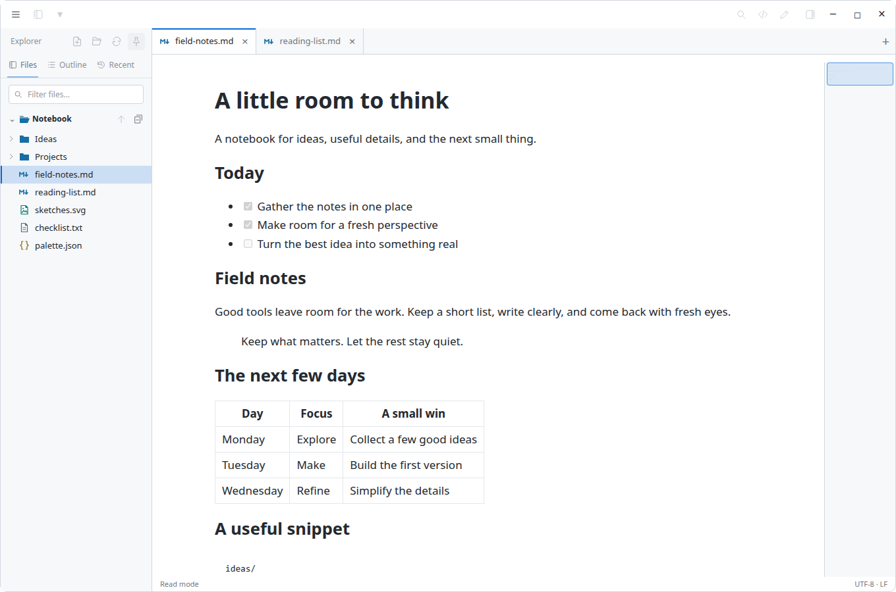
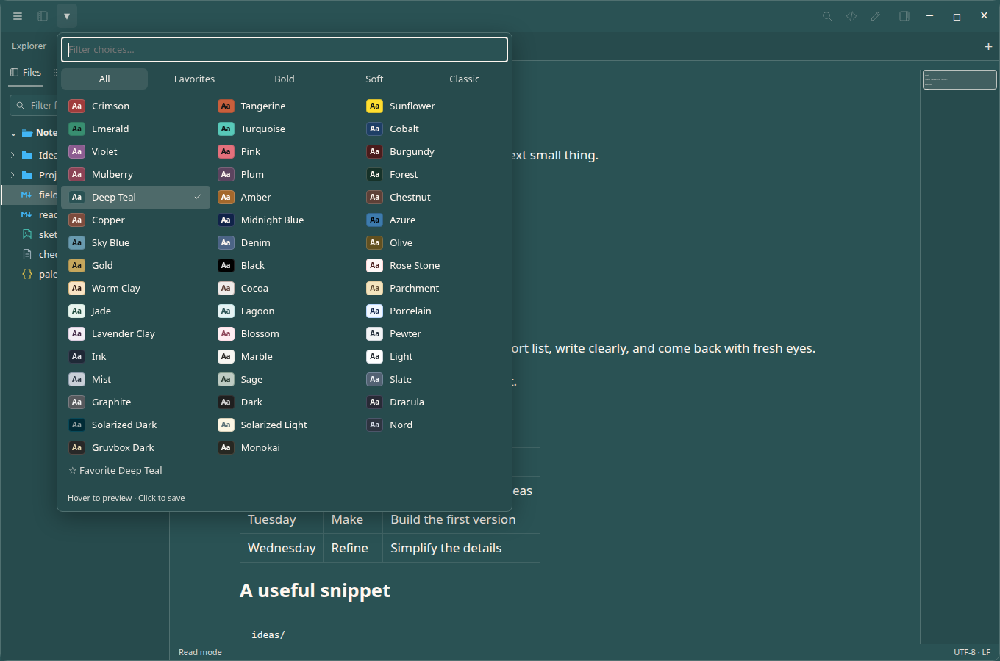

<p align="center">
  
</p>

<h1 align="center">BS Notepad</h1>
<p align="center">A quiet desktop workspace for notes, Markdown, source files, and images.</p>
<p align="center">Windows · Linux · macOS</p>



Read a document, switch to its source, and edit it in the same window. BS Notepad keeps the controls subtle, your files close by, and the colors your own.

## What it does

- **Read and write.** Rendered Markdown, syntax-colored source, an editor, and a reading column that adapts to wide tables and code.
- **Keep a workspace.** A file tree with file-type icons, folder expansion, filtering, an outline, and recent files. Right-click or middle-click a file to open it in a tab.
- **Pick your colors.** Bold, soft, and classic themes, including black. Preview on hover, click to save, and keep favorites. Adjust text contrast and choose separate interface, reading, and code fonts.
- **Find your place.** Toggle Find, match case or whole words, replace text, jump to a line, and navigate with the optional document map.
- **Look closer.** Images open inside the workspace with fit, actual size, zoom, pan, and a magnifying lens. Click a picture in Markdown to inspect it, then return to your reading position.
- **Return to your work.** Restore tabs and positions, reopen a closed tab, and recover unsaved drafts after an interrupted session. Saving checks for changes made on disk.

### Your colors



### Pictures belong in the notebook


Screenshots show the app's actual interface in a browser test fixture with sample content. Fonts and native window behavior can vary by platform.

## Getting started

Open a file with **Ctrl+O**, or choose a folder with **Ctrl+Shift+O**. Dragging a file into the window also opens it. Use **Ctrl+E** to switch between editing and reading; **Ctrl+S** saves.

The main menu is at the upper left. Files and the theme picker sit beside it. Find, Source, Edit, and the document map are on the right. Controls brighten when hovered or focused. A single open document shows its name in the top bar; opening another reveals tabs.

The source repository does not contain compiled applications. Build instructions are below; any downloadable packages should be supplied separately as release assets.

| Platform | Running a built package |
| --- | --- |
| Windows | Keep `bs-notepad.exe` and `WebView2Loader.dll` together in a writable folder. The WebView2 runtime is required. Run the executable. |
| Linux | Run `bs-notepad` from a writable folder with GTK 3 and WebKitGTK 4.1 available. |
| macOS | Place `BS Notepad.app` in a writable folder. The packaging script targets macOS 14 or later and the build machine's architecture. Packages are ad-hoc signed, not notarized. |

Windows packages also include `register-file-types.ps1` and `installed.json`. The script optionally registers Markdown file types for the current user; choose BS Notepad through **Open with** afterward. Pass `-Remove` to undo the registration.

## Keyboard shortcuts

On macOS, use **Command** in place of **Ctrl** for the commands below.

| Action | Shortcut |
| --- | --- |
| New tab | Ctrl+T or Ctrl+N |
| Open file / folder | Ctrl+O / Ctrl+Shift+O |
| Save / save a copy | Ctrl+S / Ctrl+Shift+S |
| Edit / preview | Ctrl+E |
| Rendered / source view | Ctrl+U |
| Find / replace | Ctrl+F / Ctrl+H |
| Go to line | Ctrl+G |
| Show / hide files | Ctrl+B |
| Close / reopen tab | Ctrl+W / Ctrl+Shift+T |
| Next / previous tab | Ctrl+Tab / Ctrl+Shift+Tab |
| Zoom | Ctrl+wheel or Ctrl+Plus / Ctrl+Minus |
| Reset zoom | Ctrl+0 |
| Options / help | Ctrl+, / F1 |

With the image canvas focused, **F** fits the picture and **M** toggles the magnifier. **Escape** returns from an embedded picture to its Markdown document.

## Files and privacy

Your notes remain ordinary files in the folders you choose. On Windows and Linux, app settings, recovery drafts, and logs live beside the executable. On macOS, they live in `bs-notepad-data` beside the app bundle. Keep that data when moving your installation, and keep it out of shared source archives.

Remote images in Markdown can make network requests; disable them in **Options → Document** if you want to prevent those image requests. Recent files and restored tabs can contain local paths. **Clear recent files** is available in the main menu. Recovery drafts are a fallback, not a substitute for saving or keeping backups.

Images are view-only and limited to 32 MB. PNG, JPEG, GIF, WebP, BMP, ICO, SVG, and AVIF are recognized; decoding depends on the platform's webview. Large text files use a read-only preview of the first 256 KB once they exceed the configured threshold. UTF-8 and BOM-marked UTF-16 files retain their encoding and line endings when saved.

## Build from source

The build scripts expect a checkout named `repo` inside a project directory. Outputs stay outside the checkout:

```text
bs-notepad/
├── repo/       # this repository
├── tmp/        # compilation, caches, and test output
└── deploy/     # built application packages
```

Clone your chosen repository URL into that layout:

```sh
mkdir -p bs-notepad
cd bs-notepad
git clone YOUR_REPOSITORY_URL repo
```

Run the following commands from the enclosing `bs-notepad` directory. Rust **1.95 or later** is required. Build scripts use locked dependencies and default to offline mode; prepare the dependency cache explicitly before the first build.

### Linux

Install a C/C++ build toolchain, `pkg-config`, and the GTK 3 and WebKitGTK 4.1 development libraries using your distribution's packages. Then:

```sh
mkdir -p tmp/build tmp/cache tmp/cargo
export CARGO_HOME="$PWD/tmp/cargo" XDG_CACHE_HOME="$PWD/tmp/cache"
export CARGO_TARGET_DIR="$PWD/tmp/target" TMPDIR="$PWD/tmp/build"
cargo fetch --locked --manifest-path repo/Cargo.toml
repo/scripts/build.sh linux
```

Output: `deploy/linux/bs-notepad`.

### Windows cross-build

The provided Windows packager runs on Linux or WSL. It requires the `x86_64-pc-windows-gnu` Rust target and an x86-64 MinGW compiler and resource tools, in addition to the dependency cache prepared above.

```sh
repo/scripts/build.sh windows
```

Output: `deploy/windows/`. To copy the package to a Windows destination, set it explicitly:

```sh
WINDOWS_DEST=/mnt/c/Apps/bs-notepad repo/scripts/build.sh windows --install
```

Installation preserves settings and retains previous application files. It does not start the application.

### macOS

Build on a Mac with the command-line developer tools and a Rust 1.95+ toolchain installed under the project's `tmp/cargo` and `tmp/rustup` directories. The script uses those directories explicitly.

```sh
repo/scripts/build-macos.sh --setup
```

`--setup` permits downloading the locked dependencies; subsequent builds can omit it to work offline. Output goes to `deploy/macos/` as an app bundle and an archive. Public notarization is not part of this script.

### Checks

With the dependency cache and platform development libraries available:

```sh
mkdir -p tmp/build
CARGO_TARGET_DIR="$PWD/tmp/target" TMPDIR="$PWD/tmp/build" \
  cargo test --release --offline --locked -j 2 --manifest-path repo/Cargo.toml
```

`repo/scripts/check-ui.sh` exercises the exported interface and image viewers with `agent-browser`. `repo/scripts/check-portable.sh` checks a built Linux application on a virtual display and requires Xvfb. These tools must already be installed; the scripts do not install them.

## Project

Maintained by [IronWolve](https://github.com/IronWolve). When reporting a bug, include the app version, operating system, and steps to reproduce it. Use a small sample file with personal information removed.
