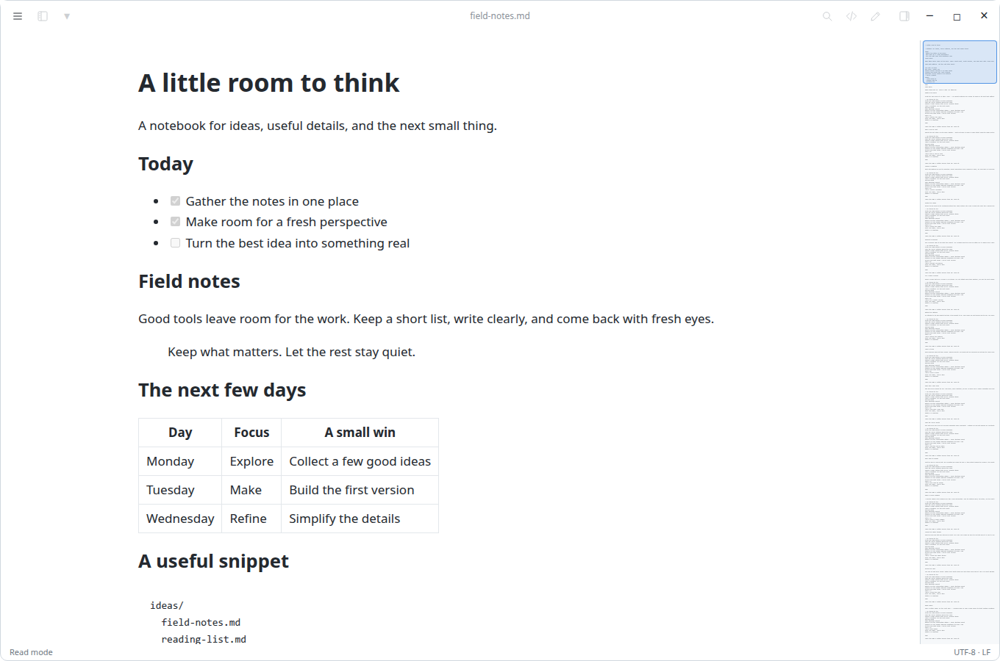
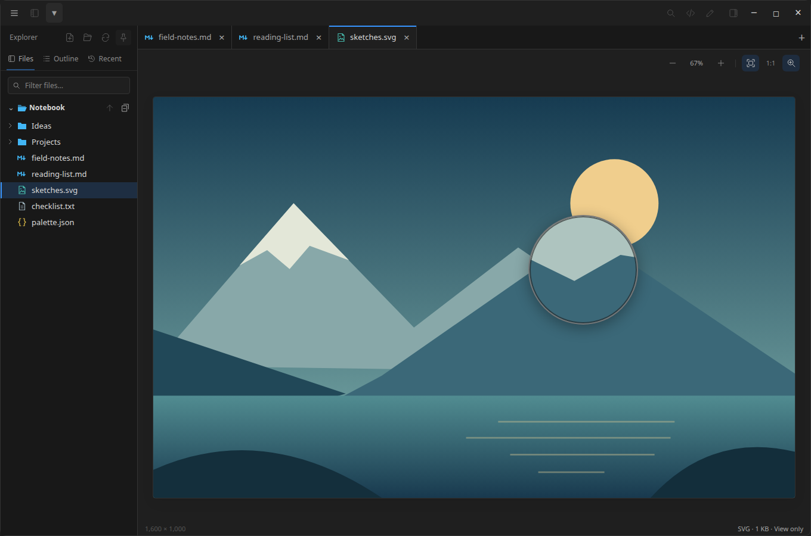

  

<h1 align="center">BS Notepad</h1>

A quiet desktop workspace for notes, Markdown, source files, and images.

Windows · Linux · macOS

Read a document, switch to its source, and edit it in the same window. BS Notepad keeps the controls subtle, your files close by, and the colors your own.

## What it does

- **Read and write.** Rendered Markdown, syntax-colored source, an editor, and a reading column that adapts to wide tables and code.
- **Keep a workspace.** A file tree with file-type icons, folder expansion and filtering. A toolbar Outline button shows document headings. Right-click or middle-click a file to open it in a tab.
- **Pick your colors.** Bold, soft, and classic themes, including black. Preview on hover, click to save, and keep favorites. Adjust text contrast, choose rounded or square tabs with a quiet active-tab accent, and set separate interface, reading, and code fonts.
- **Find your place.** Toggle Find, match case or whole words, replace text, jump to a line, and navigate with the optional document map.
- **Look closer.** Images open inside the workspace with fit, actual size, zoom, pan, and a magnifying lens. Click a picture in Markdown to inspect it, then return to your reading position.
- **Return to your work.** Restore tabs and positions, reopen a closed tab, and recover unsaved drafts after an interrupted session. Saving checks for changes made on disk.

### Your colors

### Pictures belong in the notebook

Screenshots show the app's actual interface in a browser test fixture with sample content. Fonts and native window behavior can vary by platform.

## Getting started

Open a file with **Ctrl+O**, or choose a folder with **Ctrl+Shift+O**. Dragging a file into the window also opens it. Use **Ctrl+E** to switch between editing and reading; **Ctrl+S** saves.

The main menu is at the upper left. Files and the theme picker sit beside it. Find, Outline, Source, Edit, and the document map are on the right. Controls brighten when hovered or focused. A single open document shows its name in the top bar; opening another reveals tabs.

[Download the latest release](https://github.com/IronWolve/bs-notepad/releases/latest) for Windows, macOS, or Linux. ZIP packages include checksums, the project copyright notice, and third-party notices. Compiled applications are distributed separately from this source repository. The public checkout keeps application source in `src/`, pictures in `pics/`, and copyright notices in `licenses/`, with this README at the repository root; local build manifests, build scripts, tools, and tests are not included, so it is not a standalone buildable checkout.

| Platform | Running a built package |
| --- | --- |
| Windows | Keep `bs-notepad.exe` and `WebView2Loader.dll` together in a writable folder. The WebView2 runtime is required. Run the executable. |
| Linux | Run `bs-notepad` from a writable folder with GTK 3 and WebKitGTK 4.1 available. |
| macOS | Place `BS Notepad.app` in a writable folder. The packaging script targets macOS 14 or later and the build machine's architecture. Packages are ad-hoc signed, not notarized. |

Windows packages also include `register-file-types.ps1` and `installed.json`. The script optionally registers Markdown file types for the current user; choose BS Notepad through **Open with** afterward. Pass `-Remove` to undo the registration.

## Keyboard shortcuts

On macOS, use **Command** in place of **Ctrl** for the commands below.

| Action | Shortcut |
| --- | --- |
| New tab | Ctrl+T or Ctrl+N |
| Open file / folder | Ctrl+O / Ctrl+Shift+O |
| Save / save a copy | Ctrl+S / Ctrl+Shift+S |
| Edit / preview | Ctrl+E |
| Rendered / source view | Ctrl+U |
| Find / replace | Ctrl+F / Ctrl+H |
| Go to line | Ctrl+G |
| Show / hide files | Ctrl+B |
| Close / reopen tab | Ctrl+W / Ctrl+Shift+T |
| Next / previous tab | Ctrl+Tab / Ctrl+Shift+Tab |
| Zoom | Ctrl+wheel or Ctrl+Plus / Ctrl+Minus |
| Reset zoom | Ctrl+0 |
| Options / help | Ctrl+, / F1 |

With the image canvas focused, **F** fits the picture and **M** toggles the magnifier. **Escape** returns from an embedded picture to its Markdown document.

## Files and privacy

Your notes remain ordinary files in the folders you choose. On Windows and Linux, app settings, recovery drafts, and logs live beside the executable. On macOS, they live in `bs-notepad-data` beside the app bundle. Keep that data when moving your installation, and keep it out of shared source archives.

Remote images in Markdown can make network requests; disable them in **Options → Document** if you want to prevent those image requests. Recent files and restored tabs can contain local paths. **Clear recent files** is available in the main menu. Recovery drafts are a fallback, not a substitute for saving or keeping backups.

Images are view-only and limited to 32 MB. PNG, JPEG, GIF, WebP, BMP, ICO, SVG, and AVIF are recognized; decoding depends on the platform's webview. Large text files use a read-only preview of the first 256 KB once they exceed the configured threshold. UTF-8 and BOM-marked UTF-16 files retain their encoding and line endings when saved.

## Project

Maintained by [IronWolve](https://github.com/IronWolve). When reporting a bug, include the app version, operating system, and steps to reproduce it. Use a small sample file with personal information removed.

## Copyright

Copyright © 2026 IronWolve. All rights reserved. No license is currently granted for the original project code. Third-party components remain subject to their respective licenses.

See [COPYRIGHT](licenses/COPYRIGHT) for the project notice and [third-party notices](licenses/THIRD-PARTY-NOTICES.txt) for dependency and bundled-asset licenses. The unmodified MPL-2.0 component's source and license are included in the [release ZIPs](https://github.com/IronWolve/bs-notepad/releases/latest), alongside the other required third-party license materials. These third-party permissions are not restricted by the project's copyright notice.
